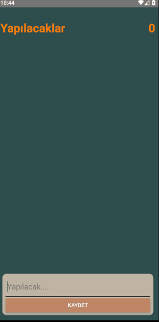

<h1 style="text-align:center">React Native Todo App</h1>
<h6>Components use in App : FlatList, TextInput, StyleSheet, TouchableOpacity, Button, View, Text</h6>

<h6>Features of App :
<ul>
<li>User can add todo</li>
<li>User can done todo</li>
<li>User can delete todo</li>
<li>User can see todo list</li>
</ul>

